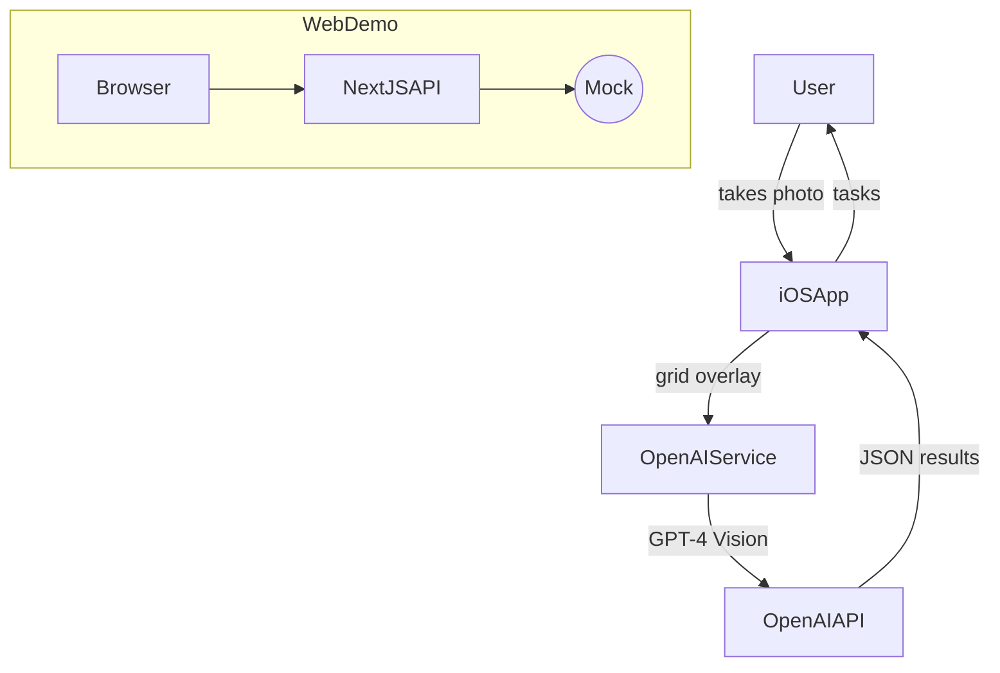

# RoomCleaner

**Declutter any messy room with AI.** RoomCleaner combines a SwiftUI iOS app and a small Next.js demo site that use OpenAI’s GPT-4 Vision to detect objects in photos, break cleaning into bite-sized tasks, and track progress.

---

## Features

• iOS app: capture up to four photos, overlay a grid, analyse with GPT-4 Vision, and generate a gamified cleaning checklist.  
• Web demo (`landing/`): upload an image and see detected boxes; collect emails for the wait-list via Supabase.  
• Grid overlay “GridGPT” technique ‑ spatial references without training a model.  
• Hard-coded fallback detections so both apps run without an API key.  
• Type-safe code, Tailwind UI, SwiftUI Animations.

## Quick-start

### 1. Prerequisites
• macOS with Xcode 15 for the iOS app.  
• Node ≥20 & pnpm (or npm) for the web demo.

### 2. Clone
```bash
 git clone https://github.com/your-org/roomcleaner.git
 cd roomcleaner
```

### 3. Environment variables
Create `.env` at the repo root (or copy the example):
```bash
cp env.example .env
# then edit .env and add your keys
```

Required keys:
```
OPENAI_API_KEY=sk-...
NEXT_PUBLIC_SUPABASE_URL=https://xyz.supabase.co
NEXT_PUBLIC_SUPABASE_ANON_KEY=public-anon-key
```

### 4. Run the web demo
```bash
cd landing
pnpm i  # or npm install
pnpm dev  # http://localhost:3000
```

### 5. Run the iOS app
```
open RoomCleaner/RoomCleaner.xcodeproj  # or .xcworkspace if you add SwiftPM packages
```
Edit `RoomCleaner/Configuration.xcconfig` and set `OPENAI_API_KEY` then hit **⌘R**.

---

## How it works (Mermaid)


---

## Roadmap / Known limitations
1. Detection accuracy ≈70% (Grid size is coarse).  
2. Costs ~$0.03 per full scan.  
3. No Android app; web demo is minimal.  
4. Export cleaning report / share progress (planned).  
5. Possible YOLO->GPT pipeline for higher accuracy.

---

## License
MIT © 2025 RoomCleaner contributors